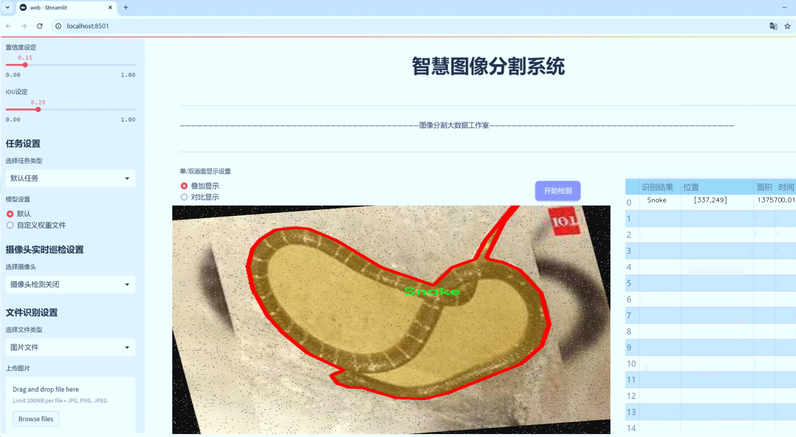
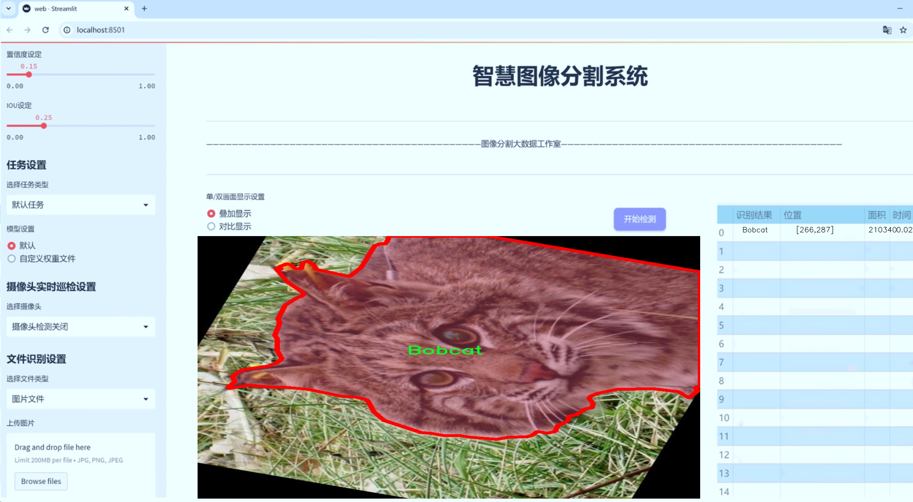
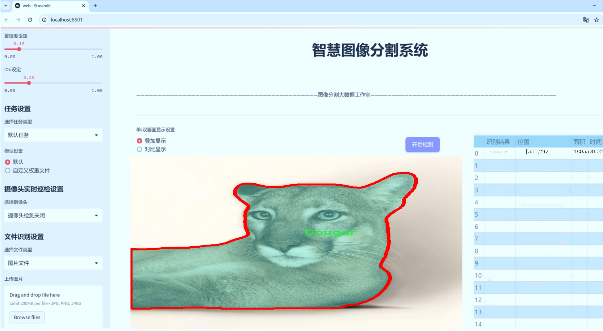
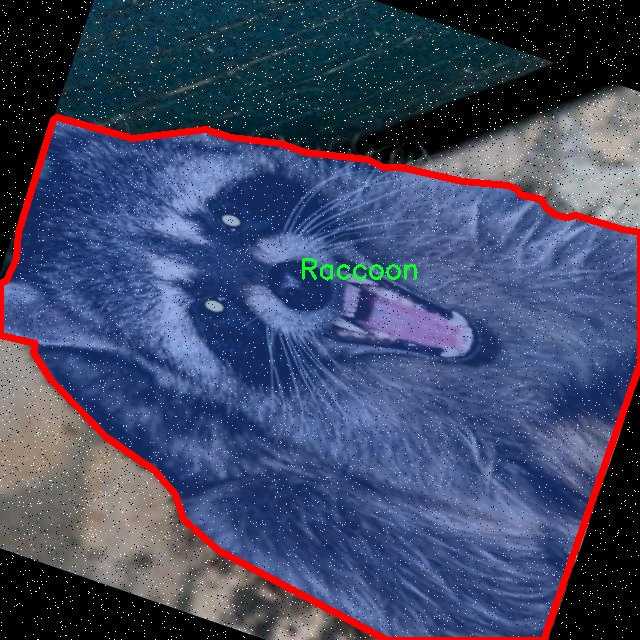
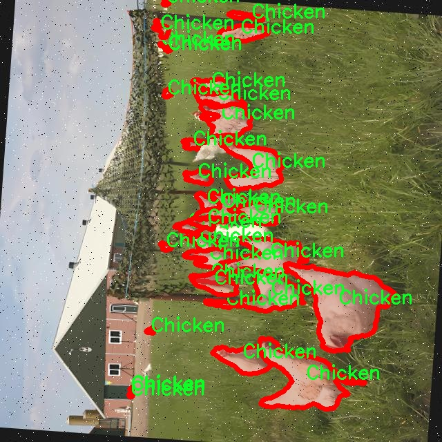
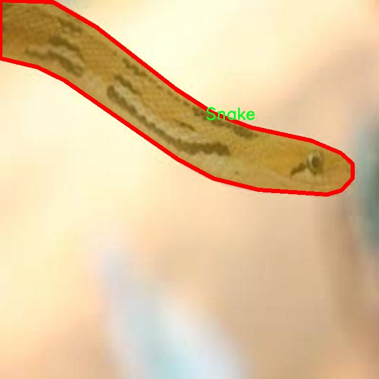
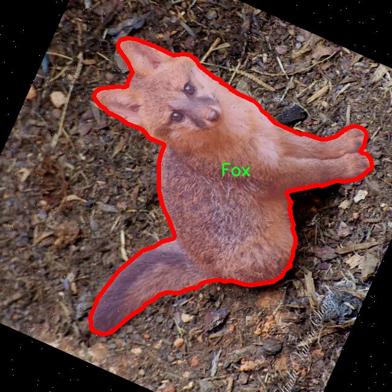
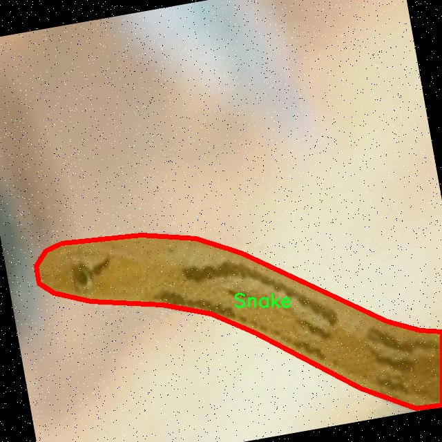

# 家禽与捕食者识别图像分割系统系统源码＆数据集分享
 [yolov8-seg-C2f-DySnakeConv＆yolov8-seg-C2f-REPVGGOREPA等50+全套改进创新点发刊_一键训练教程_Web前端展示]

### 1.研究背景与意义

项目参考[ILSVRC ImageNet Large Scale Visual Recognition Challenge](https://gitee.com/YOLOv8_YOLOv11_Segmentation_Studio/projects)

项目来源[AAAI Global Al lnnovation Contest](https://kdocs.cn/l/cszuIiCKVNis)

研究背景与意义

随着全球农业生产的不断发展，家禽养殖业在满足人类日益增长的食品需求方面发挥着重要作用。然而，家禽养殖过程中，捕食者的威胁始终是一个不容忽视的问题。捕食者不仅会直接对家禽造成伤害，还可能通过传播疾病等方式影响养殖效益。因此，及时、准确地识别捕食者与家禽之间的关系，成为了现代养殖业亟待解决的难题。传统的监测手段往往依赖人工观察，不仅效率低下，而且容易受到人为因素的影响，导致识别的准确性和及时性不足。

近年来，计算机视觉技术的快速发展为家禽与捕食者的识别提供了新的解决方案。尤其是基于深度学习的目标检测与图像分割技术，已在多个领域取得了显著的成效。YOLO（You Only Look Once）系列模型以其高效的实时检测能力，逐渐成为目标检测领域的研究热点。YOLOv8作为该系列的最新版本，结合了更为先进的网络结构和优化算法，能够在复杂环境中实现高精度的目标检测与分割。因此，基于改进YOLOv8的家禽与捕食者识别图像分割系统的研究，具有重要的理论价值和实际意义。

本研究将构建一个基于YOLOv8的家禽与捕食者识别图像分割系统，利用3000张标注良好的图像数据集，涵盖19个类别，包括家禽（如鸡、鸭、火鸡等）和多种捕食者（如狐狸、山猫、浣熊等）。该数据集的多样性和丰富性为模型的训练提供了良好的基础，使得系统能够在不同的环境和光照条件下，准确识别出目标对象。通过对捕食者与家禽的有效分割与识别，能够实现对养殖环境的实时监控，帮助养殖户及时采取防范措施，降低家禽损失，提高养殖效益。

此外，本研究还将探讨改进YOLOv8模型在图像分割任务中的应用，旨在通过优化模型结构和训练策略，提高其在复杂场景下的识别精度和速度。这不仅为家禽养殖提供了新的技术手段，也为计算机视觉领域的研究提供了新的思路和方法。通过对家禽与捕食者的有效识别与分割，能够为生态保护和生物多样性维护提供科学依据，促进可持续农业的发展。

综上所述，基于改进YOLOv8的家禽与捕食者识别图像分割系统的研究，不仅具有重要的应用价值，也为相关领域的学术研究提供了新的视角和思路。通过本研究的实施，期望能够为家禽养殖业的智能化管理提供有力支持，推动农业科技的进步与发展。

### 2.图片演示







##### 注意：由于此博客编辑较早，上面“2.图片演示”和“3.视频演示”展示的系统图片或者视频可能为老版本，新版本在老版本的基础上升级如下：（实际效果以升级的新版本为准）

  （1）适配了YOLOV8的“目标检测”模型和“实例分割”模型，通过加载相应的权重（.pt）文件即可自适应加载模型。

  （2）支持“图片识别”、“视频识别”、“摄像头实时识别”三种识别模式。

  （3）支持“图片识别”、“视频识别”、“摄像头实时识别”三种识别结果保存导出，解决手动导出（容易卡顿出现爆内存）存在的问题，识别完自动保存结果并导出到tempDir中。

  （4）支持Web前端系统中的标题、背景图等自定义修改，后面提供修改教程。

  另外本项目提供训练的数据集和训练教程,暂不提供权重文件（best.pt）,需要您按照教程进行训练后实现图片演示和Web前端界面演示的效果。

### 3.视频演示

[3.1 视频演示](https://www.bilibili.com/video/BV15W2rYaEyU/)

### 4.数据集信息展示

##### 4.1 本项目数据集详细数据（类别数＆类别名）

nc: 19
names: ['Bobcat', 'Chicken', 'Cougar', 'Coyote', 'Duck', 'Egg', 'Emu', 'Fox', 'Geese', 'Guinea Fowl', 'Opossums', 'Ostrich', 'Quail', 'Raccoon', 'Rodent', 'Skunk', 'Snake', 'Turkey', 'Weasel']


##### 4.2 本项目数据集信息介绍

数据集信息展示

在本研究中，我们采用了名为“Poultry and Predators Detection”的数据集，以改进YOLOv8-seg的家禽与捕食者识别图像分割系统。该数据集包含19个类别，涵盖了多种家禽及其潜在捕食者，旨在为图像分割任务提供丰富的训练样本。数据集的类别列表包括：Bobcat（山猫）、Chicken（鸡）、Cougar（美洲狮）、Coyote（郊狼）、Duck（鸭）、Egg（蛋）、Emu（鸸鹋）、Fox（狐狸）、Geese（鹅）、Guinea Fowl（珍珠鸡）、Opossums（负鼠）、Ostrich（鸵鸟）、Quail（鹌鹑）、Raccoon（浣熊）、Rodent（啮齿动物）、Skunk（臭鼬）、Snake（蛇）、Turkey（火鸡）和Weasel（黄鼠狼）。这些类别的选择不仅反映了家禽在自然环境中的多样性，也突显了捕食者在生态系统中的重要性。

数据集的构建过程经过精心设计，确保每个类别的样本数量和质量都能满足深度学习模型的训练需求。每个类别的图像均经过标注，包含了多种场景和光照条件下的样本，以提高模型的鲁棒性和泛化能力。例如，鸡和鸭的图像可能来自于农场环境，而郊狼和山猫的图像则可能来自于野外，这样的多样性有助于模型在不同环境下的准确识别。

此外，数据集中还包含了不同年龄段和生长阶段的家禽图像，例如幼鸟和成鸟，这对于捕食者的识别尤为重要，因为不同生长阶段的家禽可能面临不同的捕食风险。捕食者的图像同样涵盖了多种行为状态，如静止、行走和捕猎，这些变化将为模型提供更全面的特征学习机会。

在数据集的标注过程中，采用了先进的图像分割技术，以确保每个对象的边界都被准确描绘。这种精细的标注方式不仅提高了数据集的质量，也为YOLOv8-seg模型的训练提供了良好的基础。通过对每个类别的细致标注，模型能够更好地学习到不同对象之间的差异，从而在实际应用中实现更高的识别精度。

数据集的规模和多样性使其成为训练深度学习模型的理想选择。通过使用“Poultry and Predators Detection”数据集，我们期望能够显著提升YOLOv8-seg在家禽与捕食者识别任务中的表现。最终，经过充分训练的模型将能够在实际场景中有效识别和分割家禽与捕食者，帮助农民和生态研究人员更好地管理和保护家禽资源，降低捕食风险。

综上所述，“Poultry and Predators Detection”数据集不仅在类别数量和样本多样性上具有显著优势，还通过精细的标注和多样的场景设置，为YOLOv8-seg模型的训练提供了坚实的基础。我们相信，这一数据集将为家禽与捕食者的图像分割研究带来新的突破和进展。











### 5.全套项目环境部署视频教程（零基础手把手教学）

[5.1 环境部署教程链接（零基础手把手教学）](https://www.bilibili.com/video/BV1jG4Ve4E9t/?vd_source=bc9aec86d164b67a7004b996143742dc)


[5.2 安装Python虚拟环境创建和依赖库安装视频教程链接（零基础手把手教学）](https://www.bilibili.com/video/BV1nA4VeYEze/?vd_source=bc9aec86d164b67a7004b996143742dc)

### 6.手把手YOLOV8-seg训练视频教程（零基础小白有手就能学会）

[6.1 手把手YOLOV8-seg训练视频教程（零基础小白有手就能学会）](https://www.bilibili.com/video/BV1cA4VeYETe/?vd_source=bc9aec86d164b67a7004b996143742dc)


按照上面的训练视频教程链接加载项目提供的数据集，运行train.py即可开始训练



     Epoch   gpu_mem       box       obj       cls    labels  img_size
     1/200     0G   0.01576   0.01955  0.007536        22      1280: 100%|██████████| 849/849 [14:42<00:00,  1.04s/it]
               Class     Images     Labels          P          R     mAP@.5 mAP@.5:.95: 100%|██████████| 213/213 [01:14<00:00,  2.87it/s]
                 all       3395      17314      0.994      0.957      0.0957      0.0843

     Epoch   gpu_mem       box       obj       cls    labels  img_size
     2/200     0G   0.01578   0.01923  0.007006        22      1280: 100%|██████████| 849/849 [14:44<00:00,  1.04s/it]
               Class     Images     Labels          P          R     mAP@.5 mAP@.5:.95: 100%|██████████| 213/213 [01:12<00:00,  2.95it/s]
                 all       3395      17314      0.996      0.956      0.0957      0.0845

     Epoch   gpu_mem       box       obj       cls    labels  img_size
     3/200     0G   0.01561    0.0191  0.006895        27      1280: 100%|██████████| 849/849 [10:56<00:00,  1.29it/s]
               Class     Images     Labels          P          R     mAP@.5 mAP@.5:.95: 100%|███████   | 187/213 [00:52<00:00,  4.04it/s]
                 all       3395      17314      0.996      0.957      0.0957      0.0845


### 7.50+种全套YOLOV8-seg创新点代码加载调参视频教程（一键加载写好的改进模型的配置文件）

[7.1 50+种全套YOLOV8-seg创新点代码加载调参视频教程（一键加载写好的改进模型的配置文件）](https://www.bilibili.com/video/BV1Hw4VePEXv/?vd_source=bc9aec86d164b67a7004b996143742dc)

### 8.YOLOV8-seg图像分割算法原理

原始YOLOv8-seg算法原理

YOLOv8-seg算法是YOLO系列中的一个重要进展，专注于目标检测与分割任务的结合。作为一种一阶段目标检测算法，YOLOv8-seg不仅延续了YOLO系列的核心思想，还在此基础上进行了多项创新和优化，旨在提高目标检测的精度和效率。其基本原理可以追溯到YOLOv1提出的将目标检测转化为回归问题的框架，YOLOv8-seg在此基础上，通过引入先进的网络结构和技术，使得模型在处理复杂场景时更加灵活和高效。

YOLOv8-seg的网络结构由三个主要部分组成：主干网络（backbone）、特征增强网络（neck）和检测头（head）。主干网络采用了CSPNet的思想，旨在通过分离特征图的通道来增强特征提取的能力。这种设计不仅提高了网络的学习能力，还减少了计算量，使得模型在保持高精度的同时具备更快的推理速度。特征增强网络则采用了PAN-FPN结构，通过多尺度特征融合，进一步提升了模型对不同尺度目标的检测能力。这种结构能够有效地将低层次的细节信息与高层次的语义信息结合起来，使得模型在处理复杂背景和小目标时表现得更加出色。

在检测头部分，YOLOv8-seg引入了解耦头的设计，将目标的分类和回归任务分开处理。这一创新使得每个任务能够专注于自身的特征学习，从而有效减少了在复杂场景下的定位误差和分类错误。此外，YOLOv8-seg采用了Anchor-free目标检测方法，这种方法的核心在于直接预测目标的位置和大小，而不需要依赖于预定义的锚点框。这一策略的优势在于，网络能够更快地聚焦于目标的实际位置，减少了锚点框选择和调整的复杂性，从而提高了模型的整体效率。

YOLOv8-seg在训练过程中采用了多尺度训练和测试策略，这一策略通过在不同的尺度上进行训练，使得模型能够更好地适应各种目标的大小变化。结合特征金字塔网络的设计，YOLOv8-seg能够在不同层次上提取特征，进一步增强了对小目标和大目标的检测能力。这样的设计不仅提升了模型的检测精度，也使得其在实时应用中表现得更加出色。

YOLOv8-seg的另一个显著特点是其轻量化的模型权重，使得该算法能够在嵌入式设备上高效运行。这一特性使得YOLOv8-seg能够广泛应用于各种实时检测场景，如智能监控、自动驾驶、无人机视觉等领域。尤其是在资源受限的环境中，YOLOv8-seg凭借其高效的计算性能和优异的检测精度，展现出了极大的应用潜力。

此外，YOLOv8-seg在损失函数的设计上也进行了优化，以更好地适应目标分割任务。通过引入新的损失计算方法，YOLOv8-seg能够更准确地评估预测结果与真实标签之间的差异，从而在训练过程中实现更有效的学习。这一优化不仅提升了模型的收敛速度，也增强了其在复杂场景下的鲁棒性。

总的来说，YOLOv8-seg算法通过对YOLO系列的持续改进与创新，成功地将目标检测与分割任务融合在一起，形成了一种高效、精确的解决方案。其在多项技术上的突破，使得YOLOv8-seg在目标检测领域树立了新的标杆。未来，随着计算机视觉技术的不断发展，YOLOv8-seg有望在更多应用场景中发挥重要作用，为智能化时代的到来提供强有力的支持。


### 9.系统功能展示（检测对象为举例，实际内容以本项目数据集为准）

图9.1.系统支持检测结果表格显示

  图9.2.系统支持置信度和IOU阈值手动调节

  图9.3.系统支持自定义加载权重文件best.pt(需要你通过步骤5中训练获得)

  图9.4.系统支持摄像头实时识别

  图9.5.系统支持图片识别

  图9.6.系统支持视频识别

  图9.7.系统支持识别结果文件自动保存

  图9.8.系统支持Excel导出检测结果数据


### 10.50+种全套YOLOV8-seg创新点原理讲解（非科班也可以轻松写刊发刊，V11版本正在科研待更新）

#### 10.1 由于篇幅限制，每个创新点的具体原理讲解就不一一展开，具体见下列网址中的创新点对应子项目的技术原理博客网址【Blog】：


[10.1 50+种全套YOLOV8-seg创新点原理讲解链接](https://gitee.com/qunmasj/good)

#### 10.2 部分改进模块原理讲解(完整的改进原理见上图和技术博客链接)【如果此小节的图加载失败可以通过CSDN或者Github搜索该博客的标题访问原始博客，原始博客图片显示正常】

### YOLOv8简介
#### YOLOv8是什么？
YOLOv8是Ultralytics公司推出的基于对象检测模型的YOLO最新系列，它能够提供截至目前最先进的对象检测性能。

借助于以前的YOLO模型版本支持技术，YOLOv8模型运行得更快、更准确，同时为执行任务的训练模型提供了统一的框架，这包括：

目标检测
实例分割
图像分类
在撰写本文时，Ultralytics的YOLOv8存储库中其实还有很多功能有待添加，这包括训练模型的整套导出功能等。此外，Ultralytics将计划在Arxiv上发布一篇相关的论文，将对YOLOv8与其他最先进的视觉模型进行比较。

#### YOLOv8的新功能
Ultralytics为YOLO模型发布了一个全新的存储库（https://github.com/ultralytics/ultralytics）。该存储库被构建为用于训练对象检测、实例分割和图像分类模型的统一框架。

以下列举的是这个新版本的一些关键功能：

用户友好的API（命令行+Python）。
更快、更准确。
支持：
目标检测，
实例分割和
图像分类。
可扩展到所有以前的版本。
新的骨干网络。
新的Anchor-Free head对象检测算法。
新的损失函数。
此外，YOLOv8也非常高效和灵活，它可以支持多种导出格式，而且该模型可以在CPU和GPU上运行。

#### YOLOv8中提供的子模型


YOLOv8模型的每个类别中共有五个模型，以便共同完成检测、分割和分类任务。其中，YOLOv8 Nano是最快和最小的模型，而YOLOv8Extra Large（YOLOv8x）是其中最准确但最慢的模型。

YOLOv8这次发行中共附带了以下预训练模型：

在图像分辨率为640的COCO检测数据集上训练的对象检测检查点。
在图像分辨率为640的COCO分割数据集上训练的实例分割检查点。
在图像分辨率为224的ImageNet数据集上预处理的图像分类模型。
### 高效网络架构 CloAtt简介
众所周知，自从 ViTs 提出后，Transformer 基本横扫各大 CV 主流任务，包括视觉识别、目标检测和语义分割等。然而，一个比较棘手的问题就是这个架构参数量和计算量太大，所以一直被广受诟病。因此，后续有不少工作都是朝着这个方向去改进，例如 Swin-Transformer 在局部非重叠窗口中进行注意力计算，而 PVT 中则是使用平均池化来合并 token 以进一步压缩耗时。然而，这些 ViTs 由于其参数量太大以及高 FLOPs 并不适合部署到移动设备。如果我们直接缩小到适合移动设备的尺寸时，它们的性能又会显著降低。


#### MobileViT
因此，出现了不少工作聚焦于探索轻量级的视觉变换器，使 ViTs 适用于移动设备，CVHub 此前也介绍过不少的工作，大家有兴趣可以翻阅历史文章读读。例如，苹果团队提出的 MobileViT 研究了如何将 CNN 与 Transformer 相结合，而另一个工作 MobileFormer 则将轻量级的 MobileNet 与 Transformer 进行融合。此外，最新提出的 EdgeViT 提出了一个局部-全局-局部模块来聚合信息。以上工作的目标都是设计具有高性能、较少参数和低 FLOPs 的移动端友好型模型。


#### EdgeViT
然而，作者从频域编码的角度认为，在现有的轻量级模型中，大多数方法只关注设计稀疏注意力，以有效地处理低频全局信息，而使用相对简单的方法处理高频局部信息。具体而言，大多数模型如 EdgeViT 和 MobileViT，只是简单使用原始卷积提取局部表示，这些方法仅使用卷积中的全局共享权重处理高频本地信息。其他方法，如 LVT ，则是首先将标记展开到窗口中，然后使用窗口内的注意力获得高频信息。这些方法仅使用特定于每个 Token 的上下文感知权重进行局部感知。


#### LVT
虽然上述轻量级模型在多个数据集上取得了良好的结果，但没有一种方法尝试设计更有效的方法，即利用共享和上下文感知权重的优势来处理高频局部信息。基于共享权重的方法，如传统的卷积神经网络，具有平移等变性的特征。与它们不同，基于上下文感知权重的方法，如 LVT 和 NAT，具有可以随输入内容变化的权重。这两种类型的权重在局部感知中都有自己的优势。
#### NAT


受该博客的启发，本文设计了一种轻量级视觉变换器——CloAtt，其利用了上下文感知的局部增强。特别地，CloAtt 采用了双分支设计结构。
#### 局部分支
在局部分支中，本文引入了一个精心设计的 AttnConv，一种简单而有效的卷积操作符，它采用了注意力机制的风格。所提出的 AttnConv 有效地融合了共享权重和上下文感知权重，以聚合高频的局部信息。具体地，AttnConv 首先使用深度卷积（DWconv）提取局部表示，其中 DWconv 具有共享权重。然后，其使用上下文感知权重来增强局部特征。与 Non-Local 等生成上下文感知权重的方法不同，AttnConv 使用门控机制生成上下文感知权重，引入了比常用的注意力机制更强的非线性。此外，AttnConv 将卷积算子应用于 Query 和 Key 以聚合局部信息，然后计算 Q 和 K 的哈达玛积，并对结果进行一系列线性或非线性变换，生成范围在 [-1,1] 之间的上下文感知权重。值得注意的是，AttnConv 继承了卷积的平移等变性，因为它的所有操作都基于卷积。
#### 全局分支
在全局分支中则使用了传统的注意力机制，但对 K 和 V 进行了下采样以减少计算量，从而捕捉低频全局信息。最后，CloFormer 通过简单的方法将局部分支和全局分支的输出进行融合，从而使模型能够同时捕捉高频和低频信息。总的来说，CloFormer 的设计能够同时发挥共享权重和上下文感知权重的优势，提高其局部感知的能力，使其在图像分类、物体检测和语义分割等多个视觉任务上均取得了优异的性能。
如上图2所示，CloFormer 共包含一个卷积主干和四个 stage，每个 stage you Clo 模块 和 ConvFFN 组合而成的模块堆叠而成 。具体得，首先将输入图像通过卷积主干传递，以获取 token 表示。该主干由四个卷积组成，每个卷积的步长依次为2、2、1和1。接下来，tokens 经历四个 Clo 块和 ConvFFN 阶段，以提取分层特征。最后，再利用全局平均池化和全连接层生成预测结果。可以看出，整个架构非常简洁，支持即插即用！


#### ConvFFN
为了将局部信息融入 FFN 过程中，本文采用 ConvFFN 替换了常用的 FFN。ConvFFN 和常用的 FFN 的主要区别在于，ConvFFN 在 GELU 激活函数之后使用了深度卷积（DWconv），从而使 ConvFFN 能够聚合局部信息。由于DWconv 的存在，可以直接在 ConvFFN 中进行下采样而不需要引入 PatchMerge 模块。CloFormer 使用了两种ConvFFN。第一种是在阶段内的 ConvFFN，它直接利用跳跃连接。另一种是连接两个阶段的 ConvFFN，主要用于下采样操作。
#### Clo block
CloFormer 中的 Clo块 是非常关键的组件。每个 Clo 块由一个局部分支和一个全局分支组成。在全局分支中，我们首先下采样 K 和 V，然后对 Q、K 和 V 进行标准的 attention 操作，以提取低频全局信息。
虽然全局分支的设计能够有效减少注意力机制所需的浮点运算次数，并且能够获得全局的感受野。然而，它在处理高频局部信息方面的能力不足。为了解决这个问题，CloFormer 引入了局部分支，并使用 AttnConv 对高频局部信息进行处理。AttnConv 可以融合共享权重和上下文感知权重，能够更好地处理高频局部信息。因此，CloFormer 结合了全局和局部的优势来提高图像分类性能。下面我们重点讲下 AttnConv 。
#### AttnConv
AttnConv 是一个关键模块，使得所提模型能够获得高性能。它结合了一些标准的 attention 操作。具体而言，在AttnConv 中，我们首先进行线性变换以获得 Q、K和V。在进行线性变换之后，我们再对 V 进行共享权重的局部特征聚合。然后，基于处理后的 V 和 Q ，K 进行上下文感知的局部增强。具体流程可对照流程图理解，我们可以将其拆解成三个步骤。
#### Local Feature Aggregation
为了简单起见，本文直接使用一个简单的深度卷积（DWconv）来对 V 进行局部信息聚合。
#### Context-aware Local Enhancement
在将具有共享权重的局部信息整合到 V 中后，我们结合 Q 和 K 生成上下文感知权重。值得注意的是，我们使用了与局部自注意力不同的方法，该方法更加简洁。具体而言，我们首先使用两个 DWconv 对 Q 和 K 分别进行局部信息聚合。然后，我们计算 Q 和 K 的 Hadamard 乘积，并对结果进行一系列转换，以获取在 -1 到 1 之间的上下文感知权重。最后，我们使用生成的权重来增强局部特征。
#### Fusion with Global Branch
在整个 CloFormer 中，我们使用一种简单直接的方法来将局部分支和全局分支的输出进行融合。具体而言，本文是通过将这两个输出在通道维度上进行直接拼接，然后再通过一个 FC 层聚合这些特征并结合残差输出。
最后，上图展示了三种不同的方法。相比于传统卷积，AttnConv 中的上下文感知权重使得模型能够更好地适应输入内容。相比于局部自注意力机制，引入共享权重使得模型能够更好地处理高频信息，从而提高性能。此外，生成上下文感知权重的方法引入了更强的非线性性，也提高了性能。需要注意的是，AttnConv 中的所有操作都基于卷积，保持了卷积的平移等变性特性。


### 11.项目核心源码讲解（再也不用担心看不懂代码逻辑）

#### 11.1 ui.py

以下是经过简化和注释的核心代码部分：

```python
import sys
import subprocess

def run_script(script_path):
    """
    使用当前 Python 环境运行指定的脚本。

    Args:
        script_path (str): 要运行的脚本路径
    """
    # 获取当前 Python 解释器的路径
    python_path = sys.executable

    # 构建运行命令，使用 streamlit 运行指定的脚本
    command = f'"{python_path}" -m streamlit run "{script_path}"'

    # 执行命令，并捕获结果
    result = subprocess.run(command, shell=True)
    
    # 检查脚本运行是否成功
    if result.returncode != 0:
        print("脚本运行出错。")

# 主程序入口
if __name__ == "__main__":
    # 指定要运行的脚本路径
    script_path = "web.py"  # 假设脚本在当前目录下

    # 调用函数运行脚本
    run_script(script_path)
```

### 代码说明：
1. **导入模块**：
   - `sys`：用于获取当前 Python 解释器的路径。
   - `subprocess`：用于执行外部命令。

2. **`run_script` 函数**：
   - 该函数接受一个参数 `script_path`，表示要运行的 Python 脚本的路径。
   - 使用 `sys.executable` 获取当前 Python 解释器的路径。
   - 构建一个命令字符串，用于通过 `streamlit` 运行指定的脚本。
   - 使用 `subprocess.run` 执行命令，并检查返回码以判断脚本是否成功运行。

3. **主程序入口**：
   - 在 `__main__` 块中，指定要运行的脚本路径（这里假设为 `web.py`）。
   - 调用 `run_script` 函数来执行该脚本。

这个文件是一个 Python 脚本，主要功能是通过当前的 Python 环境运行一个指定的脚本，具体是运行一个名为 `web.py` 的文件。文件的开头部分导入了必要的模块，包括 `sys`、`os` 和 `subprocess`，这些模块分别用于系统操作、文件路径处理和执行外部命令。

在代码中，定义了一个名为 `run_script` 的函数，该函数接受一个参数 `script_path`，表示要运行的脚本的路径。函数内部首先获取当前 Python 解释器的路径，这通过 `sys.executable` 实现。接着，构建一个命令字符串，该命令用于调用 `streamlit` 模块来运行指定的脚本。这里使用了格式化字符串，以确保路径的正确性。

然后，使用 `subprocess.run` 方法执行构建好的命令。这个方法会在新的 shell 中运行命令，并等待其完成。执行完命令后，检查返回的状态码，如果状态码不为零，表示脚本运行出错，程序会输出一条错误信息。

在文件的最后部分，使用 `if __name__ == "__main__":` 语句来确保当该脚本作为主程序运行时，才会执行后面的代码。这里指定了要运行的脚本路径为 `web.py`，并调用 `run_script` 函数来执行它。

总的来说，这个脚本的作用是提供一个简单的接口，通过当前的 Python 环境来运行一个 Streamlit 应用，方便用户在命令行中启动相关的 Web 应用。

#### 11.2 ultralytics\utils\callbacks\wb.py

以下是代码中最核心的部分，并附上详细的中文注释：

```python
# 导入必要的库
from ultralytics.utils import SETTINGS, TESTS_RUNNING
from ultralytics.utils.torch_utils import model_info_for_loggers

try:
    # 确保不是在测试环境中运行
    assert not TESTS_RUNNING  
    # 确保WandB集成已启用
    assert SETTINGS['wandb'] is True  
    import wandb as wb  # 导入WandB库

    # 确保WandB库已正确安装
    assert hasattr(wb, '__version__')  

    import numpy as np  # 导入NumPy库
    import pandas as pd  # 导入Pandas库

    _processed_plots = {}  # 用于存储已处理的图表

except (ImportError, AssertionError):
    wb = None  # 如果导入失败或断言失败，则将wb设置为None


def _custom_table(x, y, classes, title='Precision Recall Curve', x_title='Recall', y_title='Precision'):
    """
    创建并记录自定义指标可视化到wandb.plot.pr_curve。

    该函数创建一个自定义指标可视化，模仿WandB默认的精确度-召回曲线行为，同时允许增强的自定义。
    该可视化指标用于监控模型在不同类别上的性能。

    参数:
        x (List): x轴的值；期望长度为N。
        y (List): y轴的对应值；也期望长度为N。
        classes (List): 标识每个点类别的标签；长度为N。
        title (str, optional): 图表的标题；默认为'Precision Recall Curve'。
        x_title (str, optional): x轴的标签；默认为'Recall'。
        y_title (str, optional): y轴的标签；默认为'Precision'。

    返回:
        (wandb.Object): 适合记录的wandb对象，展示自定义的指标可视化。
    """
    # 创建一个包含类别、y值和x值的数据框
    df = pd.DataFrame({'class': classes, 'y': y, 'x': x}).round(3)
    fields = {'x': 'x', 'y': 'y', 'class': 'class'}
    string_fields = {'title': title, 'x-axis-title': x_title, 'y-axis-title': y_title}
    # 返回WandB表格对象
    return wb.plot_table('wandb/area-under-curve/v0',
                         wb.Table(dataframe=df),
                         fields=fields,
                         string_fields=string_fields)


def _plot_curve(x, y, names=None, id='precision-recall', title='Precision Recall Curve', x_title='Recall', y_title='Precision', num_x=100, only_mean=False):
    """
    记录指标曲线可视化。

    该函数基于输入数据生成指标曲线，并将可视化记录到WandB。
    曲线可以表示聚合数据（均值）或单个类别数据，具体取决于'only_mean'标志。

    参数:
        x (np.ndarray): x轴的数据点，长度为N。
        y (np.ndarray): y轴的对应数据点，形状为CxN，其中C表示类别数量。
        names (list, optional): 对应于y轴数据的类别名称；长度为C。默认为空列表。
        id (str, optional): 在WandB中记录数据的唯一标识符。默认为'precision-recall'。
        title (str, optional): 可视化图表的标题。默认为'Precision Recall Curve'。
        x_title (str, optional): x轴的标签。默认为'Recall'。
        y_title (str, optional): y轴的标签。默认为'Precision'。
        num_x (int, optional): 可视化的插值数据点数量。默认为100。
        only_mean (bool, optional): 标志，指示是否仅绘制均值曲线。默认为True。

    注意:
        该函数利用'_custom_table'函数生成实际的可视化。
    """
    # 创建新的x值
    if names is None:
        names = []
    x_new = np.linspace(x[0], x[-1], num_x).round(5)

    # 创建用于记录的数组
    x_log = x_new.tolist()
    y_log = np.interp(x_new, x, np.mean(y, axis=0)).round(3).tolist()

    if only_mean:
        # 如果仅绘制均值曲线
        table = wb.Table(data=list(zip(x_log, y_log)), columns=[x_title, y_title])
        wb.run.log({title: wb.plot.line(table, x_title, y_title, title=title)})
    else:
        # 如果绘制所有类别的曲线
        classes = ['mean'] * len(x_log)
        for i, yi in enumerate(y):
            x_log.extend(x_new)  # 添加新的x值
            y_log.extend(np.interp(x_new, x, yi))  # 将y插值到新的x
            classes.extend([names[i]] * len(x_new))  # 添加类别名称
        wb.log({id: _custom_table(x_log, y_log, classes, title, x_title, y_title)}, commit=False)


def on_fit_epoch_end(trainer):
    """在每个训练周期结束时记录训练指标和模型信息。"""
    wb.run.log(trainer.metrics, step=trainer.epoch + 1)  # 记录当前周期的指标
    # 记录图表
    _log_plots(trainer.plots, step=trainer.epoch + 1)
    _log_plots(trainer.validator.plots, step=trainer.epoch + 1)
    if trainer.epoch == 0:
        # 在第一个周期记录模型信息
        wb.run.log(model_info_for_loggers(trainer), step=trainer.epoch + 1)


def on_train_end(trainer):
    """在训练结束时保存最佳模型作为artifact。"""
    # 记录验证器和训练器的图表
    _log_plots(trainer.validator.plots, step=trainer.epoch + 1)
    _log_plots(trainer.plots, step=trainer.epoch + 1)
    # 创建一个WandB artifact用于保存最佳模型
    art = wb.Artifact(type='model', name=f'run_{wb.run.id}_model')
    if trainer.best.exists():
        art.add_file(trainer.best)  # 添加最佳模型文件
        wb.run.log_artifact(art, aliases=['best'])  # 记录artifact
    # 记录验证器的曲线
    for curve_name, curve_values in zip(trainer.validator.metrics.curves, trainer.validator.metrics.curves_results):
        x, y, x_title, y_title = curve_values
        _plot_curve(
            x,
            y,
            names=list(trainer.validator.metrics.names.values()),
            id=f'curves/{curve_name}',
            title=curve_name,
            x_title=x_title,
            y_title=y_title,
        )
    wb.run.finish()  # 结束WandB运行


# 定义回调函数
callbacks = {
    'on_fit_epoch_end': on_fit_epoch_end,
    'on_train_end': on_train_end} if wb else {}
```

### 代码核心部分说明：
1. **WandB集成**：代码首先确保WandB库可用，并进行必要的初始化。
2. **自定义表格和曲线绘制**：定义了`_custom_table`和`_plot_curve`函数，用于创建和记录精确度-召回曲线的可视化。
3. **训练过程中的回调**：定义了多个回调函数，如`on_fit_epoch_end`和`on_train_end`，用于在训练的不同阶段记录指标和模型信息。

这个程序文件 `ultralytics/utils/callbacks/wb.py` 是用于集成 Weights & Biases（WandB）工具的回调函数，主要用于记录和可视化训练过程中的各种指标和图表。文件开头导入了一些必要的模块，并进行了初步的检查，以确保 WandB 的集成是启用的，并且没有在测试环境中运行。

在文件中定义了几个主要的函数。首先是 `_custom_table` 函数，它用于创建并记录一个自定义的精确度-召回曲线的可视化。这个函数接受 x 和 y 轴的数据，以及类标签和图表标题等参数，最终返回一个适合记录的 WandB 对象。

接下来是 `_plot_curve` 函数，它生成一个指标曲线的可视化。这个函数根据输入的数据生成曲线，可以选择只记录平均曲线或每个类的曲线。它会通过插值方法生成新的 x 值，并将其与 y 值进行匹配，最终利用 `_custom_table` 函数记录结果。

`_log_plots` 函数用于记录输入字典中的图表，如果在指定的步骤中尚未记录过这些图表。它会检查每个图表的时间戳，以避免重复记录。

文件中还定义了一些回调函数，如 `on_pretrain_routine_start`、`on_fit_epoch_end`、`on_train_epoch_end` 和 `on_train_end`。这些函数在训练的不同阶段被调用，以记录训练指标、模型信息和图表等。在每个训练周期结束时，都会记录当前的损失、学习率以及图表，并在训练结束时保存最佳模型作为一个工件。

最后，文件定义了一个 `callbacks` 字典，将这些回调函数与相应的事件关联起来，便于在训练过程中调用。整体来看，这个文件的目的是为了增强模型训练过程中的可视化和监控，方便开发者跟踪模型的性能和进展。

#### 11.3 ultralytics\utils\loss.py

以下是代码中最核心的部分，并附上详细的中文注释：

```python
import torch
import torch.nn as nn
import torch.nn.functional as F

class BboxLoss(nn.Module):
    def __init__(self, reg_max, use_dfl=False):
        """初始化BboxLoss模块，设置最大正则化值和DFL选项。"""
        super().__init__()
        self.reg_max = reg_max  # 最大正则化值
        self.use_dfl = use_dfl  # 是否使用分布焦点损失
        self.nwd_loss = False  # 是否使用NWD损失
        self.iou_ratio = 0.5  # IoU比率

    def forward(self, pred_dist, pred_bboxes, anchor_points, target_bboxes, target_scores, target_scores_sum, fg_mask):
        """计算IoU损失和DFL损失。"""
        weight = target_scores.sum(-1)[fg_mask].unsqueeze(-1)  # 计算权重
        iou = bbox_iou(pred_bboxes[fg_mask], target_bboxes[fg_mask], xywh=False, CIoU=True)  # 计算IoU
        loss_iou = ((1.0 - iou) * weight).sum() / target_scores_sum  # IoU损失

        # DFL损失
        if self.use_dfl:
            target_ltrb = bbox2dist(anchor_points, target_bboxes, self.reg_max)  # 将目标框转换为分布
            loss_dfl = self._df_loss(pred_dist[fg_mask].view(-1, self.reg_max + 1), target_ltrb[fg_mask]) * weight  # 计算DFL损失
            loss_dfl = loss_dfl.sum() / target_scores_sum  # 归一化DFL损失
        else:
            loss_dfl = torch.tensor(0.0).to(pred_dist.device)  # 如果不使用DFL，损失为0

        return loss_iou, loss_dfl  # 返回IoU损失和DFL损失

    @staticmethod
    def _df_loss(pred_dist, target):
        """返回DFL损失的和。"""
        tl = target.long()  # 目标左边界
        tr = tl + 1  # 目标右边界
        wl = tr - target  # 左边权重
        wr = 1 - wl  # 右边权重
        # 计算DFL损失
        return (F.cross_entropy(pred_dist, tl.view(-1), reduction='none').view(tl.shape) * wl +
                F.cross_entropy(pred_dist, tr.view(-1), reduction='none').view(tl.shape) * wr).mean(-1, keepdim=True)

class v8DetectionLoss:
    """计算检测任务的损失。"""

    def __init__(self, model):
        """初始化v8DetectionLoss，设置模型相关属性和BCE损失函数。"""
        device = next(model.parameters()).device  # 获取模型设备
        m = model.model[-1]  # 获取检测模块
        self.bce = nn.BCEWithLogitsLoss(reduction='none')  # 使用BCE损失
        self.reg_max = m.reg_max  # 最大正则化值
        self.device = device  # 设备

        self.bbox_loss = BboxLoss(m.reg_max - 1, use_dfl=True).to(device)  # 初始化边界框损失

    def __call__(self, preds, batch):
        """计算损失并返回。"""
        loss = torch.zeros(3, device=self.device)  # 初始化损失数组
        pred_distri, pred_scores = preds  # 获取预测的分布和分数

        # 计算目标
        targets = torch.cat((batch['batch_idx'].view(-1, 1), batch['cls'].view(-1, 1), batch['bboxes']), 1)
        gt_labels, gt_bboxes = targets.split((1, 4), 2)  # 分割目标标签和边界框

        # 计算边界框损失
        pred_bboxes = self.bbox_decode(pred_distri)  # 解码预测的边界框
        loss[0], loss[2] = self.bbox_loss(pred_distri, pred_bboxes, gt_bboxes, batch['target_scores'])  # 计算损失

        return loss.sum()  # 返回总损失
```

### 代码核心部分解释：
1. **BboxLoss类**：
   - 负责计算边界框的损失，包括IoU损失和可选的分布焦点损失（DFL）。
   - `forward`方法计算预测边界框与目标边界框之间的IoU，并返回损失。

2. **v8DetectionLoss类**：
   - 负责整体检测任务的损失计算。
   - 在初始化时设置模型参数和损失函数。
   - `__call__`方法处理输入的预测结果和目标，计算并返回总损失。

### 主要功能：
- 计算目标检测任务中的边界框损失，支持IoU和DFL损失。
- 整合多个损失计算模块，提供统一的接口进行损失计算。

这个程序文件是Ultralytics YOLO（You Only Look Once）模型的损失函数实现，主要用于目标检测、分割和姿态估计等任务。文件中定义了多个损失类，每个类负责计算特定类型的损失，以优化模型的性能。

首先，`SlideLoss`类实现了一种滑动损失函数，它通过调整损失的权重来适应不同的IoU（Intersection over Union）阈值。构造函数中接受一个损失函数作为参数，并将其reduction设置为'none'，以便对每个元素单独应用滑动损失。在`forward`方法中，根据给定的IoU值计算损失，并根据不同的条件调整损失的权重。

接下来，`EMASlideLoss`类是`SlideLoss`的扩展，使用指数移动平均来平滑IoU值的变化。它在训练过程中更新IoU的平均值，并根据该值调整损失的计算。

`VarifocalLoss`类实现了一种变焦损失函数，旨在提高模型对难以分类样本的关注。它通过加权的二元交叉熵损失来计算损失，其中权重是根据预测分数和真实标签动态计算的。

`FocalLoss`类则实现了焦点损失，旨在解决类别不平衡问题。它通过对难以分类的样本给予更高的权重来优化损失。

`BboxLoss`类负责计算边界框的损失，包括IoU损失和可选的分布焦点损失（DFL）。它通过计算预测边界框与目标边界框之间的IoU来计算损失，并根据需要计算DFL损失。

`KeypointLoss`类用于计算关键点的损失，主要通过计算预测关键点与真实关键点之间的欧几里得距离来实现。

`v8DetectionLoss`类是YOLOv8模型的检测损失类，整合了边界框损失、分类损失和DFL损失。它在初始化时设置了一些模型相关的参数，并在`__call__`方法中计算总损失。

`v8SegmentationLoss`和`v8PoseLoss`类分别用于分割和姿态估计任务，继承自`v8DetectionLoss`，并实现了特定于这些任务的损失计算逻辑。

最后，`v8ClassificationLoss`类用于计算分类任务的损失，使用交叉熵损失函数来评估预测结果与真实标签之间的差异。

整体而言，这个文件提供了一系列灵活且高效的损失函数实现，旨在提升YOLO模型在不同任务中的表现。通过合理的损失函数设计，模型能够更好地学习和优化目标检测、分割和姿态估计等任务。

#### 11.4 ultralytics\nn\modules\head.py

以下是经过简化并注释的核心代码部分，主要包括 YOLOv8 的检测头（Detect 类）及其相关功能。

```python
import torch
import torch.nn as nn
from .conv import Conv  # 导入卷积模块
from .utils import bias_init_with_prob  # 导入偏置初始化工具

class Detect(nn.Module):
    """YOLOv8 检测头，用于目标检测模型。"""
    
    def __init__(self, nc=80, ch=()):
        """初始化 YOLOv8 检测层，指定类别数和通道数。
        
        参数:
            nc (int): 类别数量，默认为 80。
            ch (tuple): 输入通道数的元组。
        """
        super().__init__()
        self.nc = nc  # 类别数量
        self.nl = len(ch)  # 检测层数量
        self.reg_max = 16  # DFL 通道数
        self.no = nc + self.reg_max * 4  # 每个锚点的输出数量
        self.stride = torch.zeros(self.nl)  # 在构建过程中计算的步幅
        c2, c3 = max((16, ch[0] // 4, self.reg_max * 4)), max(ch[0], min(self.nc, 100))  # 通道数设置
        
        # 定义卷积层，cv2 用于回归，cv3 用于分类
        self.cv2 = nn.ModuleList(
            nn.Sequential(Conv(x, c2, 3), Conv(c2, c2, 3), nn.Conv2d(c2, 4 * self.reg_max, 1)) for x in ch)
        self.cv3 = nn.ModuleList(nn.Sequential(Conv(x, c3, 3), Conv(c3, c3, 3), nn.Conv2d(c3, self.nc, 1)) for x in ch)
        
        # DFL 层，若 reg_max <= 1 则使用恒等映射
        self.dfl = DFL(self.reg_max) if self.reg_max > 1 else nn.Identity()

    def forward(self, x):
        """连接并返回预测的边界框和类别概率。
        
        参数:
            x (list): 输入特征图列表。
        
        返回:
            y (Tensor): 包含边界框和类别概率的张量。
        """
        shape = x[0].shape  # 获取输入形状 BCHW
        for i in range(self.nl):
            # 对每个检测层进行卷积操作并连接结果
            x[i] = torch.cat((self.cv2[i](x[i]), self.cv3[i](x[i])), 1)
        
        # 如果是训练模式，直接返回
        if self.training:
            return x
        
        # 动态生成锚点和步幅
        self.anchors, self.strides = (x.transpose(0, 1) for x in make_anchors(x, self.stride, 0.5))
        self.shape = shape

        # 将所有层的输出拼接在一起
        x_cat = torch.cat([xi.view(shape[0], self.no, -1) for xi in x], 2)
        
        # 分割边界框和类别概率
        box, cls = x_cat.split((self.reg_max * 4, self.nc), 1)
        dbox = dist2bbox(self.dfl(box), self.anchors.unsqueeze(0), xywh=True, dim=1) * self.strides

        # 归一化边界框
        img_h = shape[2] * self.stride[0]
        img_w = shape[3] * self.stride[0]
        img_size = torch.tensor([img_w, img_h, img_w, img_h], device=dbox.device).reshape(1, 4, 1)
        dbox /= img_size

        # 返回拼接后的边界框和类别概率
        y = torch.cat((dbox, cls.sigmoid()), 1)
        return y

    def bias_init(self):
        """初始化 Detect() 的偏置，警告：需要步幅可用。"""
        m = self  # self.model[-1]  # Detect() 模块
        for a, b, s in zip(m.cv2, m.cv3, m.stride):  # 遍历卷积层
            a[-1].bias.data[:] = 1.0  # 边界框偏置初始化
            b[-1].bias.data[:m.nc] = math.log(5 / m.nc / (640 / s) ** 2)  # 类别偏置初始化
```

### 代码说明：
1. **Detect 类**：这是 YOLOv8 的检测头，负责处理输入特征并输出边界框和类别概率。
2. **初始化方法**：在初始化时，设置类别数量、检测层数量、输出数量等，并定义卷积层。
3. **前向传播方法**：通过卷积层处理输入特征，动态生成锚点，并计算最终的边界框和类别概率。
4. **偏置初始化方法**：用于初始化卷积层的偏置，以提高模型的收敛速度和性能。

此代码是 YOLOv8 模型的核心部分，主要用于目标检测任务。

这个程序文件是Ultralytics YOLO（You Only Look Once）模型的一个模块，主要实现了模型的头部（head）部分，包括检测、分割、姿态估计和分类等功能。文件中包含多个类，每个类负责不同的任务。

首先，`Detect`类是YOLOv8检测头的实现。它初始化了检测层，定义了类别数量、输出数量和特征通道等参数。在`forward`方法中，该类接收输入特征图，经过一系列卷积操作后，输出预测的边界框和类别概率。该方法还处理了动态锚框的生成，并根据需要对输出进行归一化。

接下来，`Segment`类继承自`Detect`类，专门用于分割模型。它增加了对掩码的处理，初始化了掩码原型，并在`forward`方法中返回掩码系数和其他输出。

`Pose`类同样继承自`Detect`类，主要用于关键点检测。它初始化了关键点的形状，并在`forward`方法中处理输入，返回关键点的预测结果。

`Classify`类是YOLOv8的分类头，实现了从输入图像到类别的映射。它使用卷积层、池化层和全连接层进行特征提取和分类。

最后，`RTDETRDecoder`类实现了实时可变形Transformer解码器，结合了Transformer架构和可变形卷积，用于物体检测。它通过多层Transformer解码器处理特征，并输出边界框和分类分数。该类还包含了一些辅助方法，用于生成锚框和处理输入特征。

整个文件中使用了PyTorch库来构建神经网络模块，并且通过不同的类和方法实现了YOLOv8模型的不同功能。这些类的设计使得模型能够灵活地处理多种任务，包括检测、分割、姿态估计和分类。

#### 11.5 ultralytics\data\build.py

以下是经过简化并添加详细中文注释的核心代码部分：

```python
import os
import random
import numpy as np
import torch
from torch.utils.data import dataloader

from .dataset import YOLODataset  # 导入YOLO数据集类
from .utils import PIN_MEMORY  # 导入内存固定选项

class InfiniteDataLoader(dataloader.DataLoader):
    """
    无限循环的数据加载器，继承自PyTorch的DataLoader。
    """

    def __init__(self, *args, **kwargs):
        """初始化无限数据加载器，重用工作线程。"""
        super().__init__(*args, **kwargs)
        object.__setattr__(self, 'batch_sampler', _RepeatSampler(self.batch_sampler))  # 设置重复采样器
        self.iterator = super().__iter__()  # 创建迭代器

    def __len__(self):
        """返回批采样器的长度。"""
        return len(self.batch_sampler.sampler)

    def __iter__(self):
        """创建一个无限重复的采样器。"""
        for _ in range(len(self)):
            yield next(self.iterator)  # 迭代返回下一个样本

    def reset(self):
        """重置迭代器，用于在训练过程中修改数据集设置。"""
        self.iterator = self._get_iterator()  # 重新获取迭代器


class _RepeatSampler:
    """
    无限重复的采样器。

    参数:
        sampler (Dataset.sampler): 要重复的采样器。
    """

    def __init__(self, sampler):
        """初始化一个无限重复的采样器。"""
        self.sampler = sampler

    def __iter__(self):
        """无限迭代采样器的内容。"""
        while True:
            yield from iter(self.sampler)  # 持续返回采样器的内容


def seed_worker(worker_id):
    """设置数据加载器工作线程的随机种子，以确保可重复性。"""
    worker_seed = torch.initial_seed() % 2 ** 32  # 获取当前线程的随机种子
    np.random.seed(worker_seed)  # 设置numpy的随机种子
    random.seed(worker_seed)  # 设置Python的随机种子


def build_yolo_dataset(cfg, img_path, batch, data, mode='train', rect=False, stride=32):
    """构建YOLO数据集。"""
    return YOLODataset(
        img_path=img_path,  # 图像路径
        imgsz=cfg.imgsz,  # 图像大小
        batch_size=batch,  # 批次大小
        augment=mode == 'train',  # 是否进行数据增强
        hyp=cfg,  # 超参数配置
        rect=cfg.rect or rect,  # 是否使用矩形批次
        cache=cfg.cache or None,  # 缓存设置
        single_cls=cfg.single_cls or False,  # 是否使用单类
        stride=int(stride),  # 步幅
        pad=0.0 if mode == 'train' else 0.5,  # 填充
        classes=cfg.classes,  # 类别
        data=data,  # 数据配置
        fraction=cfg.fraction if mode == 'train' else 1.0  # 训练时的样本比例
    )


def build_dataloader(dataset, batch, workers, shuffle=True, rank=-1):
    """返回用于训练或验证集的InfiniteDataLoader或DataLoader。"""
    batch = min(batch, len(dataset))  # 确保批次大小不超过数据集大小
    nd = torch.cuda.device_count()  # 获取CUDA设备数量
    nw = min([os.cpu_count() // max(nd, 1), batch if batch > 1 else 0, workers])  # 计算工作线程数量
    sampler = None if rank == -1 else distributed.DistributedSampler(dataset, shuffle=shuffle)  # 分布式采样器
    generator = torch.Generator()  # 创建随机数生成器
    generator.manual_seed(6148914691236517205 + RANK)  # 设置随机种子
    return InfiniteDataLoader(dataset=dataset,  # 返回无限数据加载器
                              batch_size=batch,
                              shuffle=shuffle and sampler is None,
                              num_workers=nw,
                              sampler=sampler,
                              pin_memory=PIN_MEMORY,
                              worker_init_fn=seed_worker,  # 设置工作线程的初始化函数
                              generator=generator)  # 设置随机数生成器
```

### 代码说明：
1. **InfiniteDataLoader**: 这是一个自定义的数据加载器，允许无限次迭代数据集，适用于需要持续训练的场景。
2. **_RepeatSampler**: 这是一个辅助类，用于实现无限循环的采样器。
3. **seed_worker**: 该函数确保每个工作线程在数据加载时使用相同的随机种子，以便于结果的可重复性。
4. **build_yolo_dataset**: 该函数用于构建YOLO数据集，接收配置参数并返回一个YOLODataset实例。
5. **build_dataloader**: 该函数用于创建数据加载器，支持分布式训练和多线程加载数据。

这个程序文件是用于构建和管理YOLO（You Only Look Once）模型的数据加载器，主要功能是处理图像和视频数据，以便于模型进行训练和推理。程序中使用了PyTorch库来实现数据加载和处理。

首先，文件导入了一些必要的库，包括操作系统相关的库、随机数生成库、路径处理库、NumPy、Torch以及一些图像处理库和YOLO相关的模块。接着，定义了一个名为`InfiniteDataLoader`的类，这个类继承自PyTorch的`DataLoader`，其主要功能是实现一个可以无限循环使用的工作线程，以便在训练过程中不断地提供数据。

`InfiniteDataLoader`类的构造函数中，使用了一个名为`_RepeatSampler`的类来实现对数据的无限重复采样。`_RepeatSampler`类的`__iter__`方法通过无限循环来返回样本。`InfiniteDataLoader`还定义了一个`reset`方法，用于在训练过程中修改数据集设置时重置迭代器。

接下来，定义了一个`seed_worker`函数，用于设置数据加载器工作线程的随机种子，以确保每次运行时的随机性一致性。

`build_yolo_dataset`函数用于构建YOLO数据集。它接收配置参数、图像路径、批次大小等信息，并返回一个`YOLODataset`对象。这个函数会根据训练模式决定是否进行数据增强，并设置其他参数，如图像大小、是否使用单类等。

`build_dataloader`函数则用于返回一个`InfiniteDataLoader`或普通的`DataLoader`，根据训练或验证集的需要进行配置。它会计算可用的工作线程数量，并根据是否在分布式环境中运行来设置采样器。

`check_source`函数用于检查输入数据源的类型，并返回相应的标志值。它支持多种输入格式，包括文件路径、URL、图像对象、张量等，并根据输入类型进行相应的处理。

最后，`load_inference_source`函数用于加载推理源，支持多种输入类型，并应用必要的转换。根据输入源的类型，函数会选择相应的加载器来处理数据，如加载图像、视频流、屏幕截图等。

整体而言，这个程序文件的设计旨在为YOLO模型提供灵活而高效的数据加载和处理机制，以支持不同的数据源和训练需求。

#### 11.6 train.py

以下是经过简化并添加详细中文注释的核心代码部分：

```python
import os
import torch
import yaml
from ultralytics import YOLO  # 导入YOLO模型库

if __name__ == '__main__':  # 确保该模块被直接运行时才执行以下代码
    # 设置训练参数
    workers = 1  # 数据加载的工作进程数量
    batch = 8  # 每个批次的样本数量
    device = "0" if torch.cuda.is_available() else "cpu"  # 判断是否使用GPU

    # 获取数据集配置文件的绝对路径
    data_path = abs_path(f'datasets/data/data.yaml', path_type='current')

    # 将路径转换为Unix风格
    unix_style_path = data_path.replace(os.sep, '/')
    # 获取数据集目录路径
    directory_path = os.path.dirname(unix_style_path)

    # 读取YAML配置文件
    with open(data_path, 'r') as file:
        data = yaml.load(file, Loader=yaml.FullLoader)

    # 修改YAML文件中的路径项
    if 'train' in data and 'val' in data and 'test' in data:
        data['train'] = directory_path + '/train'  # 更新训练集路径
        data['val'] = directory_path + '/val'      # 更新验证集路径
        data['test'] = directory_path + '/test'    # 更新测试集路径

        # 将修改后的数据写回YAML文件
        with open(data_path, 'w') as file:
            yaml.safe_dump(data, file, sort_keys=False)

    # 加载YOLO模型
    model = YOLO(r"C:\codeseg\codenew\50+种YOLOv8算法改进源码大全和调试加载训练教程（非必要）\改进YOLOv8模型配置文件\yolov8-seg-C2f-Faster.yaml").load("./weights/yolov8s-seg.pt")

    # 开始训练模型
    results = model.train(
        data=data_path,  # 指定训练数据的配置文件路径
        device=device,  # 指定训练设备
        workers=workers,  # 数据加载的工作进程数量
        imgsz=640,  # 输入图像的大小
        epochs=100,  # 训练的轮数
        batch=batch,  # 每个批次的样本数量
    )
```

### 代码注释说明：
1. **导入必要的库**：引入了操作系统、PyTorch、YAML处理库和YOLO模型库。
2. **主程序入口**：使用`if __name__ == '__main__':`确保代码块只在直接运行时执行。
3. **设置训练参数**：定义了数据加载的工作进程数量、批次大小和设备选择（GPU或CPU）。
4. **获取数据集配置文件路径**：使用`abs_path`函数获取数据集的YAML配置文件的绝对路径。
5. **读取和修改YAML文件**：读取YAML文件，更新训练、验证和测试集的路径，并将修改后的内容写回文件。
6. **加载YOLO模型**：根据指定的配置文件和权重文件加载YOLO模型。
7. **训练模型**：调用`model.train`方法开始训练，传入必要的参数，包括数据路径、设备、工作进程数量、图像大小、训练轮数和批次大小。

该程序文件`train.py`主要用于训练YOLO（You Only Look Once）目标检测模型。首先，程序导入了必要的库，包括`os`、`torch`、`yaml`和`ultralytics`中的YOLO模型。接着，程序设置了图形界面的后端为`TkAgg`，这通常用于可视化。

在`__main__`模块中，程序首先定义了一些训练参数，包括工作进程数`workers`、批次大小`batch`、以及设备类型`device`。设备类型的设置会根据是否有可用的GPU来决定，如果有则使用GPU（"0"），否则使用CPU（"cpu"）。

接下来，程序通过`abs_path`函数获取数据集配置文件`data.yaml`的绝对路径，并将其转换为Unix风格的路径。然后，程序提取该路径的目录部分，以便后续使用。

程序打开并读取`data.yaml`文件，使用`yaml`库保持原有的顺序读取数据。此时，程序检查YAML文件中是否包含`train`、`val`和`test`三个字段，如果有，则将它们的路径修改为相对于目录路径的格式。修改后的数据会被写回到原YAML文件中。

在模型加载部分，程序使用YOLO模型的配置文件（如`yolov8-seg-C2f-Faster.yaml`）来初始化模型，并加载预训练的权重文件`yolov8s-seg.pt`。这里需要注意的是，不同的YOLO模型对设备的要求不同，用户可以根据自己的需求选择合适的模型。

最后，程序调用`model.train()`方法开始训练模型，传入训练数据的配置文件路径、设备类型、工作进程数、输入图像大小（640x640）、训练的epoch数量（100）以及批次大小（8）等参数。

整体而言，该程序实现了YOLO模型的训练流程，包括数据准备、模型加载和训练参数设置等步骤。

### 12.系统整体结构（节选）

### 整体功能和构架概括

该项目是一个基于YOLO（You Only Look Once）模型的目标检测框架，主要用于训练、推理和评估目标检测模型。项目结构清晰，包含多个模块，每个模块负责特定的功能。整体架构可以分为以下几个部分：

1. **数据处理**：包括数据加载、预处理和增强，确保模型能够接收合适格式的数据进行训练和推理。
2. **模型构建**：定义了YOLO模型的不同部分，包括头部、骨干网络和其他辅助模块，以便于构建和扩展模型。
3. **损失计算**：实现了多种损失函数，以优化模型的训练过程。
4. **训练流程**：负责设置训练参数、加载数据、初始化模型并开始训练。
5. **回调机制**：集成了WandB等工具，用于监控训练过程和记录训练指标。

### 文件功能整理表

| 文件路径                                      | 功能描述                                                                 |
|-----------------------------------------------|--------------------------------------------------------------------------|
| `ui.py`                                       | 提供一个接口，通过当前Python环境运行指定的Streamlit应用。                     |
| `ultralytics/utils/callbacks/wb.py`          | 集成Weights & Biases工具，记录和可视化训练过程中的指标和图表。                 |
| `ultralytics/utils/loss.py`                   | 实现多种损失函数，包括滑动损失、焦点损失和边界框损失等，用于优化模型训练。       |
| `ultralytics/nn/modules/head.py`              | 定义YOLO模型的头部，包括检测、分割、姿态估计和分类功能。                      |
| `ultralytics/data/build.py`                   | 构建和管理数据加载器，处理图像和视频数据，以支持模型训练和推理。                |
| `train.py`                                    | 设置训练参数，加载数据和模型，并启动YOLO模型的训练过程。                     |
| `ultralytics/nn/extra_modules/block.py`      | 定义额外的模块块，可能用于构建更复杂的网络结构。                               |
| `ultralytics/models/yolo/pose/predict.py`    | 实现姿态估计的推理功能，处理输入数据并输出关键点预测结果。                     |
| `ultralytics/nn/extra_modules/head.py`       | 定义额外的头部模块，可能用于特定任务的模型输出。                               |
| `ultralytics/nn/modules/block.py`            | 定义基本的网络模块，构建神经网络的基础组件。                                   |
| `ultralytics/models/rtdetr/model.py`         | 实现实时可变形Transformer模型的构建和推理功能。                               |
| `ultralytics/models/sam/build.py`            | 可能用于构建特定的模型或模块，具体功能需根据文件内容进一步分析。               |
| `ultralytics/nn/backbone/lsknet.py`          | 定义YOLO模型的骨干网络，负责特征提取和处理。                                   |

以上表格总结了每个文件的主要功能，展示了项目的模块化设计和各部分之间的关系。

注意：由于此博客编辑较早，上面“11.项目核心源码讲解（再也不用担心看不懂代码逻辑）”中部分代码可能会优化升级，仅供参考学习，完整“训练源码”、“Web前端界面”和“50+种创新点源码”以“14.完整训练+Web前端界面+50+种创新点源码、数据集获取”的内容为准。

### 13.图片、视频、摄像头图像分割Demo(去除WebUI)代码

在这个博客小节中，我们将讨论如何在不使用WebUI的情况下，实现图像分割模型的使用。本项目代码已经优化整合，方便用户将分割功能嵌入自己的项目中。
核心功能包括图片、视频、摄像头图像的分割，ROI区域的轮廓提取、类别分类、周长计算、面积计算、圆度计算以及颜色提取等。
这些功能提供了良好的二次开发基础。

### 核心代码解读

以下是主要代码片段，我们会为每一块代码进行详细的批注解释：

```python
import random
import cv2
import numpy as np
from PIL import ImageFont, ImageDraw, Image
from hashlib import md5
from model import Web_Detector
from chinese_name_list import Label_list

# 根据名称生成颜色
def generate_color_based_on_name(name):
    ......

# 计算多边形面积
def calculate_polygon_area(points):
    return cv2.contourArea(points.astype(np.float32))

...
# 绘制中文标签
def draw_with_chinese(image, text, position, font_size=20, color=(255, 0, 0)):
    image_pil = Image.fromarray(cv2.cvtColor(image, cv2.COLOR_BGR2RGB))
    draw = ImageDraw.Draw(image_pil)
    font = ImageFont.truetype("simsun.ttc", font_size, encoding="unic")
    draw.text(position, text, font=font, fill=color)
    return cv2.cvtColor(np.array(image_pil), cv2.COLOR_RGB2BGR)

# 动态调整参数
def adjust_parameter(image_size, base_size=1000):
    max_size = max(image_size)
    return max_size / base_size

# 绘制检测结果
def draw_detections(image, info, alpha=0.2):
    name, bbox, conf, cls_id, mask = info['class_name'], info['bbox'], info['score'], info['class_id'], info['mask']
    adjust_param = adjust_parameter(image.shape[:2])
    spacing = int(20 * adjust_param)

    if mask is None:
        x1, y1, x2, y2 = bbox
        aim_frame_area = (x2 - x1) * (y2 - y1)
        cv2.rectangle(image, (x1, y1), (x2, y2), color=(0, 0, 255), thickness=int(3 * adjust_param))
        image = draw_with_chinese(image, name, (x1, y1 - int(30 * adjust_param)), font_size=int(35 * adjust_param))
        y_offset = int(50 * adjust_param)  # 类别名称上方绘制，其下方留出空间
    else:
        mask_points = np.concatenate(mask)
        aim_frame_area = calculate_polygon_area(mask_points)
        mask_color = generate_color_based_on_name(name)
        try:
            overlay = image.copy()
            cv2.fillPoly(overlay, [mask_points.astype(np.int32)], mask_color)
            image = cv2.addWeighted(overlay, 0.3, image, 0.7, 0)
            cv2.drawContours(image, [mask_points.astype(np.int32)], -1, (0, 0, 255), thickness=int(8 * adjust_param))

            # 计算面积、周长、圆度
            area = cv2.contourArea(mask_points.astype(np.int32))
            perimeter = cv2.arcLength(mask_points.astype(np.int32), True)
            ......

            # 计算色彩
            mask = np.zeros(image.shape[:2], dtype=np.uint8)
            cv2.drawContours(mask, [mask_points.astype(np.int32)], -1, 255, -1)
            color_points = cv2.findNonZero(mask)
            ......

            # 绘制类别名称
            x, y = np.min(mask_points, axis=0).astype(int)
            image = draw_with_chinese(image, name, (x, y - int(30 * adjust_param)), font_size=int(35 * adjust_param))
            y_offset = int(50 * adjust_param)

            # 绘制面积、周长、圆度和色彩值
            metrics = [("Area", area), ("Perimeter", perimeter), ("Circularity", circularity), ("Color", color_str)]
            for idx, (metric_name, metric_value) in enumerate(metrics):
                ......

    return image, aim_frame_area

# 处理每帧图像
def process_frame(model, image):
    pre_img = model.preprocess(image)
    pred = model.predict(pre_img)
    det = pred[0] if det is not None and len(det)
    if det:
        det_info = model.postprocess(pred)
        for info in det_info:
            image, _ = draw_detections(image, info)
    return image

if __name__ == "__main__":
    cls_name = Label_list
    model = Web_Detector()
    model.load_model("./weights/yolov8s-seg.pt")

    # 摄像头实时处理
    cap = cv2.VideoCapture(0)
    while cap.isOpened():
        ret, frame = cap.read()
        if not ret:
            break
        ......

    # 图片处理
    image_path = './icon/OIP.jpg'
    image = cv2.imread(image_path)
    if image is not None:
        processed_image = process_frame(model, image)
        ......

    # 视频处理
    video_path = ''  # 输入视频的路径
    cap = cv2.VideoCapture(video_path)
    while cap.isOpened():
        ret, frame = cap.read()
        ......
```


### 14.完整训练+Web前端界面+50+种创新点源码、数据集获取


# [下载链接：https://mbd.pub/o/bread/Zp2Ukpts](https://mbd.pub/o/bread/Zp2Ukpts)